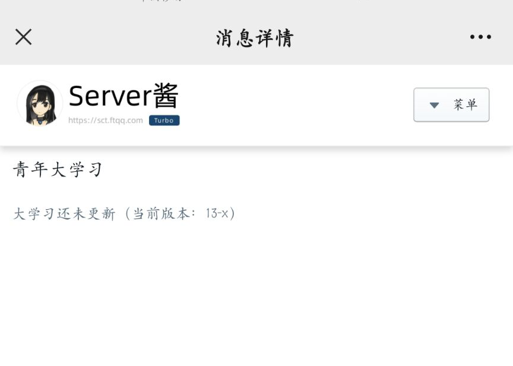
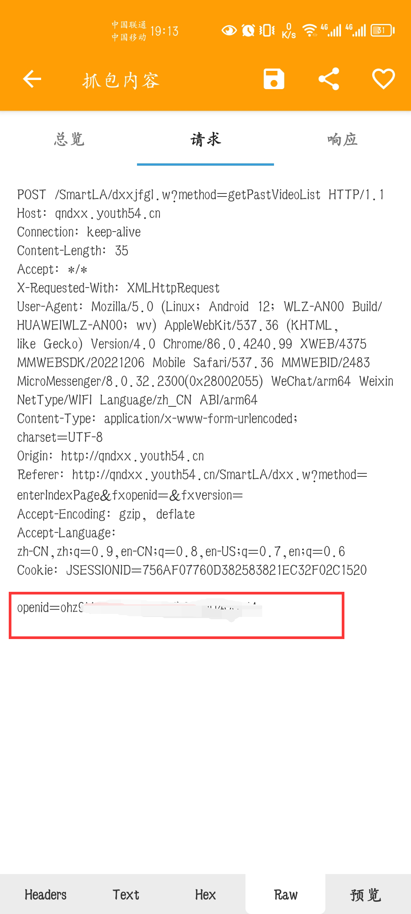

# 自动完成青年大学习
## 声明：👀该脚本代码主要参考<a href = "https://github.com/captain686/Youth-Learning">captain686|Youth-Learning</a>👀<br/>

>我把其中关键代码拿了出来，放到了一个脚本文件中。并且增加了查询学习记录功能😎和多账号功能😍😍，如果最新一期的大学习版本号和当前已经学过的版本号不一致则代表未进行学习，则进行学习。
<br/>

###  代理方式  <br/>
> 😢青年大学习屏蔽大多数的云服务的ip，所以需要使用代理，我改变了原作者使用代理池的方法，使用代理池可能更稳定，但是为了方便，主要是懒😜。我就直接自己定义代理IP了。直接mian.py中修改 ``` proxy = {'https': 'https://127.0.0.1:7890'} ```即可。<br/>
> 这里推荐一个免费的代理池，如果失效的话，可以到🛫<a href = 'https://www.freeproxy.world/'>FreeProxy</a>找到中国的代理（中国的青年大学习，使用中国的代理，国外的我没试过🤦‍♂️）

### 🚀推送方式🚀

我新增加了可以向微信推送的方式，我使用的是<a href = 'https://sct.ftqq.com/'>Server酱</a>，注册拿到SendKey(不会的话，可百度🙄)，然后在main.py中修改``` SCKEY = '' ``` 即可。
> 🍷🍷🍷在以下情况下会向你的微信发送通知：🍷🍷🍷<br/>
> >1.完成最新一期的大学习后<br/>
> >2.脚本正常运行，但是大学习未更新，无法完成学习<br/>
> >3.大学习已经更新到最新一期，但是无法正常完成学习<br/>
推送效果：<br/>

***

### 使用方法
抓取"openid"的值，这个东西，相当于你的大学习账号，每个人的不一样


> > 😊 安卓系统可以使用`HttpCanary`进行抓包（不需要root，安装CA即可）
> > 这里是安装CA教程：<a href = 'https://blog.csdn.net/weixin_53891182/article/details/124739048?ops_request_misc=%257B%2522request%255Fid%2522%253A%2522167447216016800213015890%2522%252C%2522scm%2522%253A%252220140713.130102334..%2522%257D&request_id=167447216016800213015890&biz_id=0&utm_medium=distribute.pc_search_result.none-task-blog-2~all~sobaiduend~default-1-124739048-null-null.142^v71^insert_chatgpt,201^v4^add_ask&utm_term=httpcanary%E4%B8%8B%E8%BD%BD&spm=1018.2226.3001.4187'>点这里</a>。安装CA后,即可以正常使用。
> > > 1. 在设置中选择微信，对其进行抓包
> > > 2. 开启抓包访问青年大学习
> > > 3. 在抓包历史中搜索youth54.cn，找到`POST`请求可以找到`openid`
> > >

> > 🍎IOS用户可使用Stream进行抓取
> >
> > > 1.  在设置里设置 `HTTPS`抓包
> > >
> > > 2.  设置抓包模式为白名单模式
> > >
> > > 3.  添加抓包域名 `*.youth54.cn`
> > >
> > > 4.  开启抓包访问青年大学习
> > >
> > > 5.  筛选抓包历史中的 `POST`请求可以找到 `openid`
> >(IOS没有样图，不要问为什么，问就是没有iphone😅😅😅)
> > > 你也可以选择使用电脑微信抓包
> > >电脑抓包可以使用<a href = 'https://www.wireshark.org/'>WireShark</a>，使用方法，自行百度。
> > > 
>
# 关于 `mian.py`
>需要修改的地方只有下面几个地方：<br/>

> > ````bash
# 设置代理，这个地方先不用改，代理失效的话再修改
proxy = {'https': 'https://127.0.0.1:7890'}
#填写openid，可以是多个账号，多个账号的请用英文逗号隔开，例如'AA','BB'
openids = ['']
#server推送方式
SCKEY = ''
```

## 部署方法
> 主要是一些经常用的一些网站的签到什么的，想用的话随便拿去用<br/>
> 不定时增加新脚本<br/>
<br/>
> 实现每天定时执行脚本的话，有很多种方法，可自上网找部署教程：<br/>
> 1.最简单的就是将脚本部署在<a href="https://console.cloud.tencent.com/scf/list?rid=33&ns=default">腾讯云函数</a>上。 <br/>
> 2.你如果拥有自己的服务器的话，可以部署在<b><a href="https://github.com/whyour/qinglong">青龙面板</a></b>上或者是<b><a href = > "https://github.com/elecV2/elecV2P">elecV2P</a></b>上，作者都在使用的两个工具，推荐青龙面板，比较好操作。<br/>
> 3.放在GitHub Action上面，这个稍微麻烦一点，而且GitHub官方抵制 GitHub Action的滥用，容易暴毙。不推荐<br/>
> 4.还有很多种方法，可自行上网查询。<br/>
因为我们使用了代理，所以说理论上这些方法都可以。作者是在阿里云的服务器上搭建的青龙面板，部署在上面的。

### 有问题，请提issues
